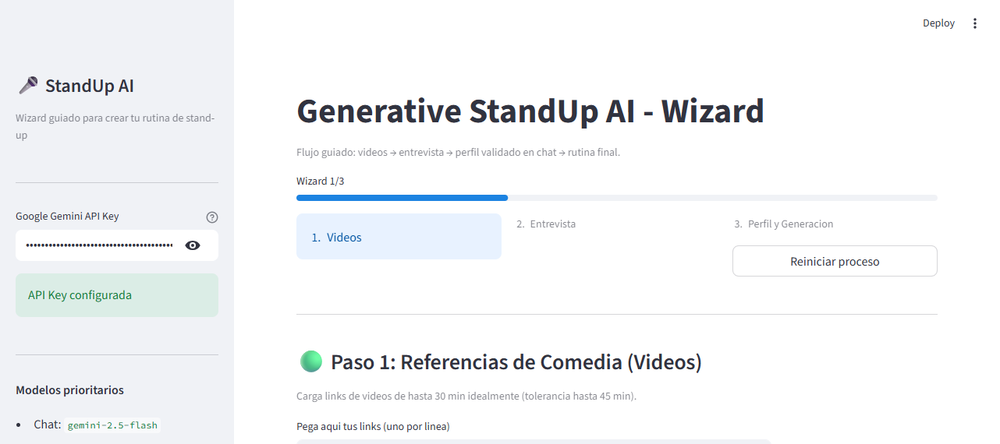

# Generative StandUp AI

Aplicacion de IA para crear rutinas de stand-up personalizadas en espanol usando un flujo guiado (wizard), RAG con referencias de comedia y un pipeline multi-agente con Gemini.

## Que hace el sistema (capacidades reales)

- Wizard de 3 pasos en Streamlit:
  - Paso 1: Ingesta de links de YouTube, validacion y construccion de base RAG.
  - Paso 2: Entrevista guiada de 15 preguntas en interfaz de chat.
  - Paso 3: Revision de perfil en chat, ajustes del reporte y generacion final.
- Extraccion de transcripciones con `youtube-transcript-api`.
- Validacion de duracion de videos:
  - Ideal: <= 30 min
  - Tolerancia: <= 45 min
- RAG con FAISS:
  - Indexa transcripciones y ejemplos base de estructuras Set-up -> Punchline.
  - Recupera contexto relevante segun temas del usuario.
- Pipeline de generacion multi-etapa:
  - Analisis de perfil
  - Escritura de rutina
  - Control de calidad (QA con metricas)
- Revisión conversacional del perfil antes de generar:
  - El usuario pide cambios por chat.
  - El sistema aplica cambios al reporte.
  - Cuando el usuario confirma con "si", se habilita/dispara la generacion.
- Exportacion del resultado:
  - Descarga en TXT
  - Descarga en PDF
- Fallbacks para resiliencia:
  - Seleccion dinamica de modelo Gemini disponible
  - Fallback de embeddings locales cuando el remoto no esta disponible

## Capturas de pantalla

### Wizard - Vista principal


### Encabezado del wizard


## Arquitectura funcional

1. `video_ingestion.py`
- Procesa URLs de YouTube
- Descarga transcript
- Intenta leer metadata (titulo/duracion)
- Aplica reglas de duracion

2. `rag_engine.py`
- Inicializa vector store FAISS
- Indexa material base + transcripciones
- Recupera contexto semantico para la generacion

3. `agent_logic.py`
- Gestiona entrevista guiada
- Extrae estructura de perfil desde respuestas
- Mantiene memoria de conversacion simple

4. `generator.py`
- Ejecuta pipeline de analisis -> rutina -> QA
- Devuelve rutina y puntuaciones

5. `app.py`
- UI Streamlit (wizard, chat, validaciones, descargas)
- Orquesta el flujo completo end-to-end

## Requisitos

- Python 3.11+ (recomendado)
- API key de Google Gemini
- Sistema operativo: Windows, Linux o macOS

## Instalacion local

1. Clonar repositorio:

```bash
git clone https://github.com/techboycr/StanUpNator.git
cd StandUp-AI
```

2. Crear y activar entorno virtual:

```bash
python -m venv .venv
```

Windows (PowerShell):

```powershell
.\.venv\Scripts\Activate.ps1
```

Linux/macOS:

```bash
source .venv/bin/activate
```

3. Instalar dependencias:

```bash
pip install -r requirements.txt
```

4. Configurar variables de entorno en `.env`, puedes usar el archivo '.env_example':

```env
GOOGLE_API_KEY=tu_api_key_aqui
```

Opcional para mostrar controles de testing en UI:

```env
STANDUP_SHOW_TEST_LINKS=true
```

> En produccion, mantener `STANDUP_SHOW_TEST_LINKS` en `false` o no definirla.

## Como correr la aplicacion

```bash
streamlit run app.py
```

Luego abrir en navegador:

- http://localhost:8501

## Como usar (flujo recomendado)

1. Paso 1 - Videos
- Pega 1 o varios links de YouTube (uno por linea).
- Presiona `Next: procesar videos`.
- El sistema valida, extrae transcript e indexa en RAG.

2. Paso 2 - Entrevista
- Responde las 15 preguntas del chat con ejemplos concretos.
- Presiona `Next: construir perfil` al finalizar.

3. Paso 3 - Perfil y Generacion
- Revisa el reporte de perfil.
- Si deseas cambios, pidelos en el chat.
- Cuando este correcto, responde `si` en el chat.
- Genera material y descarga en TXT/PDF.

## Variables de entorno

- `GOOGLE_API_KEY` (obligatoria): acceso a Gemini.
- `STANDUP_SHOW_TEST_LINKS` (opcional): muestra controles de testing (`true`/`false`).

## Testing

Ejecutar pruebas unitarias:

```bash
python -m pytest tests/test_standup.py
```

## Calidad de codigo (type hints y docstrings)

El proyecto incluye:

- Type hints en funciones clave para mejorar mantenibilidad.
- Docstrings en modulos y funciones principales para explicar responsabilidades.
- Separacion modular por dominio (ingesta, RAG, agente, generador, UI).

## Despliegue en Streamlit Community Cloud

1. Subir el proyecto a GitHub.
2. Entrar a Streamlit Community Cloud y crear nueva app.
3. Seleccionar repositorio, rama y archivo de entrada `app.py`.
4. Configurar secrets:

```toml
GOOGLE_API_KEY = "tu_api_key"
```

5. Deploy.

Notas de produccion:
- No exponer llaves en el repositorio.
- Mantener desactivados controles de testing (`STANDUP_SHOW_TEST_LINKS=false`).

## Publicacion en GitHub

Flujo sugerido:

```bash
git add .
git commit -m "docs: add production README with setup, usage and screenshots"
git push origin main
```

## Limitaciones conocidas

- Dependencia de servicios externos (Gemini y YouTube).
- Transcripciones/metadata pueden fallar por restricciones del video o red.
- La calidad final depende de la calidad de respuestas en la entrevista.

## Roadmap sugerido

- Persistencia de sesiones por usuario.
- Historial de versiones de rutina.
- Ajustes manuales de tono/estructura con controles UI dedicados.
- Exportacion adicional (Markdown/Docx).
